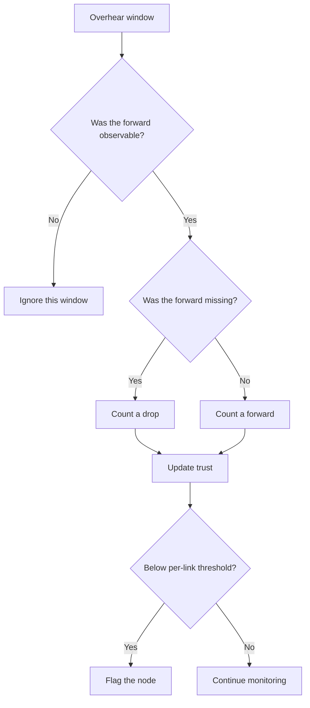

<h1 align="center">Observability-Aware Trust-Based Grayhole Detection for Underwater Acoustic Networks</h1>

A network-layer watchdog that judges forwarding only when the monitor could hear it.

  
  
  
  

  
  
  
  

## Overview

In an underwater acoustic network, a grayhole node forwards some packets and silently drops others. A watchdog estimates trust by overhearing whether the next hop forwards each packet. Underwater, a missed overhearing event does not necessarily mean a drop: the monitor may be transmitting, a collision may occur, a frame may be corrupted, or propagation may be delayed. This project plans to account for those observations before updating trust and to compare the approach with two watchdog baselines.

## Why existing watchdogs fail underwater

- A monitor cannot listen while it is transmitting.
- Collisions and corrupted frames can hide a forward that happened.
- Long, variable acoustic propagation delays complicate the overhearing window.
- Missed observations can falsely flag honest nodes and conceal selective drops.

## Our approach

The planned watchdog counts a missed forward as a drop only when that forward was observable. It excludes own-transmit and collision windows, and treats an on-time corrupted frame as evidence of a forward rather than a drop. Trust is then compared with a distance-based threshold for each link.

## Baselines and metrics

| Approach | Planned decision rule |
| --- | --- |
| Fixed-threshold watchdog | Compare overheard forwarding against one fixed trust threshold. |
| Channel-aware (CAD-style) watchdog | Use a per-link threshold that accounts for channel conditions. |
| Proposed approach | Count only observable missed forwards as drops, then apply a distance-based per-link threshold. |

Planned comparison metrics: **detection rate, false-positive rate, detection latency, packet delivery ratio, and overhead**. No simulation results are available yet.

## Repository layout

| Path | Purpose |
| --- | --- |
| `unet/` | Planned Groovy simulation scripts and agents. |
| `report/` | Project report files. |
| `results/` | Planned simulation outputs and graphs. |
| `tools/` | Local UnetStack and Java installs; excluded from Git. |

## Timeline

| Milestone | Date |
| --- | --- |
| Proposal | 08.10.2026 |
| Progress | 22.10.2026 |
| Final | 02.11.2026 |

## Team

CS301 Computer Networks mini project (2026–27), Team 9, NITK Surathkal.

| Member | Roll number | GitHub |
| --- | --- | --- |
| Appaji Nagaraja Dheeraj | 241CS110 | [AppajiDheeraj](https://github.com/AppajiDheeraj) |
| Aryan Bokolia | 241CS111 | [yoman12357](https://github.com/yoman12357) |
| Karthikeya Gupta | 241CS117 | [karthikeyagupta108](https://github.com/karthikeyagupta108) |

## Acknowledgements

CS301/CS302 course staff, NITK Surathkal.
